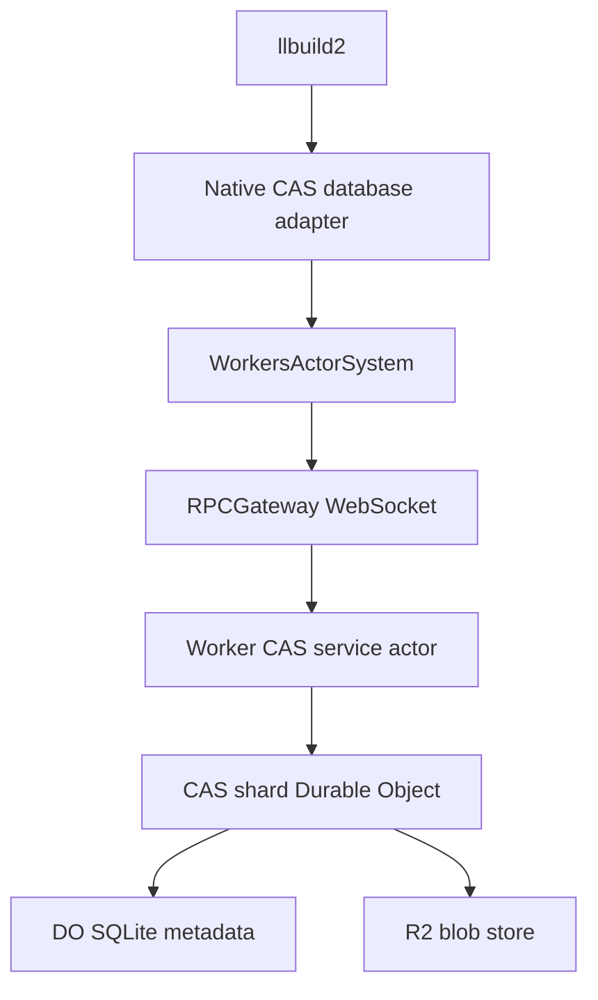

# CAS service design

## Goal

Provide a remote backend for Apple llbuild2's content-addressable storage (CAS), with a native Swift client and a Cloudflare Worker implementation written using [workers-swift](https://github.com/sevki/workers-swift).

The transport starting point is [workers-swift PR #12](https://github.com/sevki/workers-swift/pull/12): native Swift can call a distributed actor hosted by a Worker through `WorkersActorSystem` and `RPCGateway`. This gives the client a typed Swift interface. It does not make llbuild2's `CASProtocol` protobuf definition into a network protocol.

## Proposed shape

Separate llbuild2's database adapter from the service contract:

- **llbuild2 adapter (native Swift):** implements llbuild2's CAS database protocol and maps its futures to async service calls.
- **CAS service actor:** exposes typed CAS operations to the native client over `WorkersActorSystem`.
- **Worker implementation:** hosts the service actor and routes storage operations to Durable Objects.
- **CAS shard Durable Objects:** serialize operations for their key range and keep metadata in DO SQLite.
- **Blob store:** begin with SQLite for small objects; add R2 for larger payloads.

The distributed actor is a stateless façade. It must not hold authoritative CAS state in Worker memory: Worker instances can be evicted. Operations that mutate a key range are routed to a deterministic shard Durable Object, which provides a durable coordination point.



PR #12's gateway relays calls to a distributed actor hosted by the Worker via the `SELF` service binding. It does not dispatch calls directly to a Durable Object actor. Keep the shard boundary behind the service actor unless workers-swift adds explicit actor routing to Durable Objects.

## Service contract (proposal)

Use llbuild2-compatible identity and object types at the adapter boundary. The service-level wire types should be stable and independent of llbuild2's internal Swift types.

Conceptual operations:

- `contains(id)`
- `get(id)`
- `put(refs, data)`
- `putKnown(id, refs, data)`
- `findMissing(ids)`

Batch forms for lookup and insertion should be designed before performance tuning; a build can otherwise generate many small remote calls. A batch response must preserve input association and report per-item errors or conflicts unambiguously.

A CAS object includes both references and payload bytes:

```swift
struct CASObject: Codable, Sendable {
    var refs: [CASID]
    var data: Data
}
```

This is illustrative, not yet a committed wire schema. Check the exact llbuild2 API and type requirements before implementing it.

## Identity correctness (blocking design question)

Do not implement identity from an assumed formula. Before claiming that IDs are preserved:

1. Inspect the current llbuild2 source and pin the exact `identify(refs:data:)` implementation.
2. Record the precise digest algorithm and canonical byte encoding, including reference order, lengths, domain separation, and any versioning.
3. Add shared conformance vectors generated by llbuild2 and verify the Swift/Worker implementation against them.
4. Have the server recompute and verify IDs on insertion.
5. Advertise the llbuild2 `preservesIDs` feature only after these checks pass.

The digest name by itself does not define the identity encoding. `putKnown` must reject a key whose content does not identify to that key.

## Control plane and blob data

PR #12's native transport sends JSON over WebSocket. Its gateway currently JSON-parses and JSON-stringifies calls, documents loss of precision for 64-bit integers outside JavaScript's exact integer range, and the native WebSocket client caps inbound messages at 1 MiB. Treat that path as a control plane, not an unbounded blob channel.

For the first vertical slice, impose a small documented object-size limit and test it end to end. For larger payloads, use a separate HTTP streaming data path on the Worker:

1. The actor validates/authorizes a request and returns a short-lived upload or download ticket bound to the object ID and operation.
2. The native client streams bytes to or from a Worker route.
3. The Worker routes the operation to the owning shard; the shard verifies the complete object identity before making it visible.
4. Large immutable payloads live in R2; DO SQLite stores references, size, and the R2 key.
5. Make interrupted uploads invisible until verification and commit finish.

This avoids expanding every byte into JSON arrays while retaining the actor transport for typed metadata and coordination. Confirm Cloudflare request, DO, and R2 limits against current platform documentation before choosing chunk sizes or ticket lifetimes.

## Sharding and persistence

Route IDs by a fixed prefix of the verified digest. Start with 256 logical shards (first digest byte) unless measurements justify a different scheme. Derive a stable DO ID from the shard key, not from an object ID, so a shard handles many objects.

A shard record needs, at minimum:

- CAS ID (unique key)
- ordered refs
- payload size
- inline payload or R2 object key
- format/version marker

Insertion should be idempotent. If the same ID already exists, verify metadata or treat it as already present; if content differs, report an integrity failure. Keep references in their original order if llbuild2 identity depends on order.

The shard boundary is a logical routing scheme, not a promise of 256 physical objects only: Cloudflare creates DO instances on demand. Revisit partitioning, hot shards, and migration once workload characteristics are known.

## llbuild2 adapter

The native adapter should:

- implement the current llbuild2 CAS database interface;
- bridge llbuild2 futures without blocking worker threads;
- keep request-local state out of shared mutable client state;
- use local identity computation only after the canonical encoding is confirmed;
- map missing objects, transport failures, and integrity errors distinctly;
- expose batching if supported by the llbuild2 interface, or coalesce operations without violating ordering or cancellation semantics.

llbuild2 interface names and signatures are version-sensitive; pin the llbuild2 revision used by the implementation.

## Security and operations

The design still needs an authorization model. Do not expose the Worker or upload/download routes publicly without deciding how build clients authenticate and how repository or tenant namespaces isolate IDs. Bind tickets to a namespace, object ID, operation, and expiry; avoid logging payloads or secrets.

Define retention and garbage collection separately. CAS objects are immutable, but references alone do not indicate which roots must be retained. GC requires a root/lease policy and safe coordination with concurrent builds.

## Milestones

1. **Contract spike:** pin llbuild2 revision, interface signatures, identity implementation, and conformance vectors.
2. **Small-object vertical slice:** shared actor and Codable types; Worker actor and DO shard; native client; create/get/contains/missing tests.
3. **llbuild2 adapter:** future bridge and integration test using actual llbuild2 objects.
4. **Batching and integrity:** batch operations, duplicate insertion, corrupt-ID rejection, concurrency tests.
5. **Large-object data path:** HTTP streaming, R2 storage, verification and atomic visibility.
6. **Production concerns:** authentication, namespace isolation, quotas, retention/GC, observability, and deployment configuration.

## Explicit non-goals for the first slice

- Running llbuild2 inside the Cloudflare Worker.
- Treating Apple's CAS protobuf schema as a ready-made remote service protocol.
- Claiming ID preservation before the exact identity encoding is verified.
- Unbounded object transfer through PR #12's JSON gateway.
- Defining GC without a root and lease model.


## Compilation caching (swiftc CAS plugin)

The first client is not llbuild2 but swiftc's compilation caching. `swift-frontend` loads a dynamic library through `-cas-plugin-path` and drives it through the LLVM CAS plugin C API (`llcas_*`: object store and load, and an action cache keyed by digest). `CASPlugin` implements that API, so the same service that will back llbuild2 also lets separate machines share compile results.

- **Identity is this service's own.** The plugin API lets the plugin choose its hash: `CASIdentity` is SHA-256 over a domain tag, the reference digests and the data, with lengths. Server and client compute it identically; the Worker recomputes it on every store, and the client re-verifies every object it fetches. This is deliberately not llbuild2's `identify(refs:data:)`, which remains the blocking question above for the llbuild2 adapter.
- **Two tiers.** The local store (`-cas-path`) answers first. The compiler passes a `globally` flag on lookups and action puts; only then does the plugin use the Worker (`-cas-plugin-option remote-url=...`).
- **Publishing is transitive.** An action's result object is uploaded together with every object it references, children first, and the action entry is written last, so no reader can see an entry pointing at a missing object. If any part cannot be uploaded (for example it is over the size limit), the entry stays local.
- **Never fail the build.** Any remote error or timeout disables the remote for that process and compilation continues against the local cache.
- **Size.** Objects over `CASLimits.maxObjectBytes` (512 KiB) are not shared, because the control plane is JSON over a WebSocket with a 1 MiB message limit. Object files and module artifacts are routinely larger than that, so the streaming data path described above is what turns this from a working prototype into a useful cache.
- **Sharding.** 16 shards by the first hex digit of the digest. That is fixed for now; changing it needs a resharding plan.

The plugin targets the API version the toolchain was built against (`LLCAS_VERSION` 0.2, vendored from swiftlang/llvm-project as `CLLCAS`). The API is marked experimental upstream.
